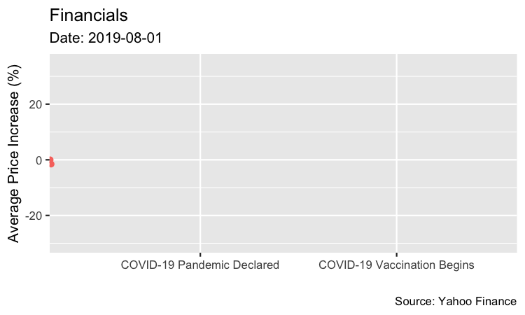
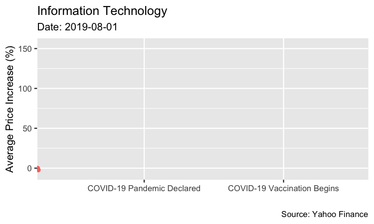

```{r setup, include=FALSE}
knitr::opts_chunk$set(echo = FALSE)
library(tidyverse)
library(lubridate)
library(gganimate)
library(gapminder)
library(gifski)
library(ggthemes)
library(grid)
library(gridExtra)
library(magick)
library(plotly)
# Learn more about creating websites with Distill at:
# https://rstudio.github.io/distill/website.html

# Learn more about publishing to GitHub Pages at:
# https://rstudio.github.io/distill/publish_website.html#github-pages

```

```{r}
sp500_data <- read.csv("SPY.csv") %>% 
  filter(ymd(Date) > ymd("2019-07-31")) %>%
  mutate(avg_val = ((Open + High + Low + Close)/4)) %>% 
  mutate(avg_price = ((avg_val/(avg_val[1]))-1)*100)

sp500 <- sp500_data %>% filter(ymd(Date) > ymd("2019-07-31")) %>% 
  mutate(Date_date = as.Date(Date)) %>% 
  mutate(pc = ifelse(ymd(Date) %in% ymd("2019-07-31"):ymd("2020-03-11"), "Before Pandemic", ifelse(ymd(Date) %in% ymd("2020-03-12"):ymd("2020-12-23"), "During Pandemic", "Vaccinations Begin"))) %>%
  select(Date, avg_price, Date_date, pc) %>% ggplot(aes(x=Date, y=avg_price, color=pc, group = 1)) + geom_point() + 
  scale_x_discrete(breaks = c("2020-03-11","2020-12-23"), labels = c("COVID-19 Pandemic Declared","COVID-19 Vaccination Begins"))+
  transition_reveal(Date_date)+transition_time(Date_date)+ 
  labs(title = "S&P 500",subtitle = "Date: {frame_time}", x = "", y = "Average Price Increase (%)", caption="Source: Yahoo Finance", color = "COVID-19 Time Frame")+
  shadow_mark(alpha = 0.7, size = 1.1)+theme(text = element_text(size = 6))
```


```{r}
merge_stocks <- function(a,b,c,d,e,type){
  a_data <- read.csv(a) %>% mutate(avg_price_a = ((Open + High + Low + Close)/4))
  b_data <- read.csv(b) %>% mutate(avg_price_b = ((Open + High + Low + Close)/4))
  c_data <- read.csv(c) %>% mutate(avg_price_c = ((Open + High + Low + Close)/4))
  d_data <- read.csv(d) %>% mutate(avg_price_d = ((Open + High + Low + Close)/4))
  e_data <- read.csv(e) %>% mutate(avg_price_e = ((Open + High + Low + Close)/4))
  
  x <- merge(a_data, b_data, by = type)
  y <- merge(c_data, d_data, by = type)
  z <- merge(x, y, by = type)
  
  merge(z, e_data, by = type) %>% 
    mutate(avg_val = ((avg_price_a+avg_price_b+avg_price_c+avg_price_d+avg_price_e)/5)) %>% 
    filter(ymd(Date) > ymd("2019-07-31")) %>% 
    mutate(avg_price = ((avg_val/(avg_val[1]))-1)*100) 
}

make_covid_graph <- function(data_set, titleName){
  data_set %>% filter(ymd(Date) > ymd("2019-07-31")) %>% 
    mutate(Date_date = as.Date(Date)) %>% 
    mutate(pc = ifelse(ymd(Date) %in% ymd("2019-07-31"):ymd("2020-03-11"), "C", ifelse(ymd(Date) %in% ymd("2020-03-12"):ymd("2020-12-23"), "E", "F"))) %>% 
    select(Date, avg_price, Date_date, pc) %>% ggplot(aes(x=Date, y=avg_price, color=pc, group = 1)) + geom_point() + 
    scale_x_discrete(breaks = c("2020-03-11","2020-12-23"), labels = c("COVID-19 Pandemic Declared","COVID-19 Vaccination Begins"))+
    transition_reveal(Date_date)+transition_time(Date_date)+ 
    labs(title = titleName,subtitle = "Date: {frame_time}", x = "", y = "Average Price Increase (%)", caption="Source: Yahoo Finance")+
    shadow_mark(alpha = 0.7, size = 1.1)+theme(text = element_text(size = 10))+ theme(legend.position='none')
  #+ylim(-150,150)
}

#aapl_data <- read.csv("AAPL.csv") %>% mutate(avg_price_AAPL = ((Open + High + Low + Close)/4))
#msft_data <- read.csv("MSFT.csv") %>% mutate(avg_price_MSFT = ((Open + High + Low + Close)/4))
#goog_data <- read.csv("GOOG.csv") %>% mutate(avg_price_GOOG = ((Open + High + Low + Close)/4))
#amzn_data <- read.csv("AMZN.csv") %>% mutate(avg_price_AMZN = ((Open + High + Low + Close)/4))
#fb_data <- read.csv("FB.csv") %>% mutate(avg_price_FB = ((Open + High + Low + Close)/4))
#x <- merge(aapl_data, msft_data, by = "Date")
#y <- merge(amzn_data, goog_data, by = "Date")
#z <- merge(x, y, by = "Date")
#tech_data <- merge(z, fb_data, by = "Date") %>% mutate(avg_price = ((avg_price_AAPL+avg_price_MSFT+avg_price_GOOG+avg_price_AMZN+avg_price_FB)/5))
energy_data <- merge_stocks("XOM.csv","CVX.csv","COP.csv","EOG.csv","SLB.csv","Date")
energy <- make_covid_graph(energy_data, "Energy")

material_data <- merge_stocks("LIN.csv","APD.csv","SHW.csv","ECL.csv","FCX.csv","Date")
materials <- make_covid_graph(material_data, "Materials")

industry_data <- merge_stocks("HON.csv","UPS.csv","UNP.csv","BA.csv","RTX.csv","Date")
industrials <- make_covid_graph(industry_data, "Industrials")

util_data <- merge_stocks("NEE.csv","DUK.csv","SO.csv","D.csv","EXC.csv","Date")
utilities <- make_covid_graph(util_data, "Utilities")

health_data <- merge_stocks("JNJ.csv","UNH.csv","PFE.csv","ABBV.csv","ABT.csv","Date")
healthCare <- make_covid_graph(health_data, "Healthcare")

finance_data <- merge_stocks("BRK-B.csv","JPM.csv","BAC.csv","WFC.csv","C.csv","Date")
financials <- make_covid_graph(finance_data, "Financials")

consDisc_data <- merge_stocks("AMZN.csv","TSLA.csv","HD.csv","MCD.csv","NKE.csv","Date")
consumerDisc <- make_covid_graph(consDisc_data, "Consumer Discretionary")

consStaple_data <- merge_stocks("PG.csv","KO.csv","PEP.csv","WMT.csv","COST.csv","Date")
consumerStaple <- make_covid_graph(consStaple_data, "Consumer Staples")

tech_data <- merge_stocks("AAPL.csv","MSFT.csv","NVDA.csv","V.csv","PYPL.csv","Date")
infoTech <- make_covid_graph(tech_data, "Information Technology")

commserv_data <- merge_stocks("FB.csv","GOOG.csv","DIS.csv","CMCSA.csv","VZ.csv","Date")
commServices <- make_covid_graph(commserv_data, "Communication Services")

realest_data <- merge_stocks("AMT.csv","PLD.csv","CCI.csv","EQIX.csv","PSA.csv","Date")
realEstate <- make_covid_graph(realest_data, "Real Estate")

```

```{r, include=FALSE}
sp5 <- animate(sp500, width = 5, height =3, units = "in", res=300)
anim_save("smp.gif", sp5)

nrg <- animate(energy, width = 5, height =3, units = "in", res=150)
anim_save("energy.gif", nrg)

mat <- animate(materials, width = 5, height = 3, units = "in", res=150)
anim_save("materials.gif", mat)

ind <- animate(industrials, width = 5, height = 3, units = "in", res=150)
anim_save("industrials.gif", ind)

util <- animate(utilities, width = 5, height = 3, units = "in", res=150)
anim_save("utilities.gif", util)

hc <- animate(healthCare, width = 5, height = 3, units = "in", res=150)
anim_save("healthCare.gif", hc)

fin <- animate(financials, width = 5, height = 3, units = "in", res=150)
anim_save("financials.gif", fin)

cDc <- animate(consumerDisc, width = 5, height = 3, units = "in", res=150)
anim_save("consumerDisc.gif", cDc)

cSt <- animate(consumerStaple, width = 5, height = 3, units = "in", res=150)
anim_save("consumerStaple.gif", cSt)

it <- animate(infoTech, width = 5, height = 3, units = "in", res=150)
anim_save("infoTech.gif", it)

cs <- animate(commServices, width = 5, height = 3, units = "in", res=150)
anim_save("commServ.gif", cs)

re <- animate(realEstate, width = 5, height = 3, units = "in", res=150)
anim_save("realEstate.gif", re)
```
```{r, include=FALSE}
nsp <- sp500_data %>% mutate(type = "S&P 500") %>% select(Date, avg_price, type) %>% filter(ymd(Date) > ymd("2019-07-31"))
eng <- energy_data %>% mutate(type = "Energy") %>% select(Date, avg_price, type) %>% filter(ymd(Date) > ymd("2019-07-31")) 
mate <- material_data %>% mutate(type = "Materials") %>% select(Date, avg_price, type) %>% filter(ymd(Date) > ymd("2019-07-31")) 
indu <- industry_data %>% mutate(type = "Industry") %>% select(Date, avg_price, type) %>% filter(ymd(Date) > ymd("2019-07-31")) 
utl <- util_data %>% mutate(type = "Utilities") %>% select(Date, avg_price, type) %>% filter(ymd(Date) > ymd("2019-07-31")) 
hec <- health_data %>% mutate(type = "Health Care") %>% select(Date, avg_price, type) %>% filter(ymd(Date) > ymd("2019-07-31")) 
fcd <- finance_data %>% mutate(type = "Financials") %>% select(Date, avg_price, type) %>% filter(ymd(Date) > ymd("2019-07-31")) 
csd <- consDisc_data %>% mutate(type = "Consumer Discretionary") %>% select(Date, avg_price, type) %>% filter(ymd(Date) > ymd("2019-07-31")) 
css <- consStaple_data %>% mutate(type = "Consumer Staples") %>% select(Date, avg_price, type) %>% filter(ymd(Date) > ymd("2019-07-31")) 
itd <- tech_data %>% mutate(type = "Information Technology") %>% select(Date, avg_price, type) %>% filter(ymd(Date) > ymd("2019-07-31")) 
cdd <- commserv_data %>% mutate(type = "Communication Services") %>% select(Date, avg_price, type) %>% filter(ymd(Date) > ymd("2019-07-31")) 
red <- realest_data %>% mutate(type = "Real Estate") %>% select(Date, avg_price, type) %>% filter(ymd(Date) > ymd("2019-07-31")) 

market_compare <- ggplot()+
  geom_area(aes(x=Date, y=avg_price, group = 1, label="S&P 500"), fill="black", alpha=0.4, data = nsp)+
  geom_area(aes(x=Date, y=avg_price, group = 2, label="Energy"), fill="green", alpha=0.4, data = eng)+
  geom_area(aes(x=Date, y=avg_price, group = 3, label="Materials"), fill="brown", alpha=0.4, data = mate)+
  geom_area(aes(x=Date, y=avg_price, group = 4, label="Industry"), fill="gray", alpha=0.4, data = indu)+
  geom_area(aes(x=Date, y=avg_price, group = 5, label="Utilities"), fill="orange", alpha=0.4, data = utl)+
  geom_area(aes(x=Date, y=avg_price, group = 6, label="Healthcare"), fill="red", alpha=0.4, data = hec)+
  geom_area(aes(x=Date, y=avg_price, group = 7, label="Financials"), fill="purple", alpha=0.4, data = fcd)+
  geom_area(aes(x=Date, y=avg_price, group = 8, label="Consumer Discretionary"), fill="yellow", alpha=0.4, data = csd)+
  geom_area(aes(x=Date, y=avg_price, group = 9, label="Consumer Staples"), fill="pink", alpha=0.4, data = css)+
  geom_area(aes(x=Date, y=avg_price, group = 10, label="Information Technology"), fill="blue", alpha=0.4, data = itd)+
  geom_area(aes(x=Date, y=avg_price, group = 11, label="Communication Services"), fill="red", alpha=0.4, data = cdd)+
  geom_area(aes(x=Date, y=avg_price, group = 12, label="Real Estate"), fill="violet", alpha=0.4, data = red)+
  scale_x_discrete(breaks = c("2020-03-11","2020-12-23"), labels = c("COVID-19 Pandemic Declared","COVID-19 Vaccination Begins"))+
  labs(title = "General Market Comparison (S&P 500 vs. Each GISC Sector)",subtitle = "Information Technology rose significantly", x = "", y = "Average Price Increase (%)", caption="Source: Yahoo Finance", color = "COVID-19 Time Frame")
```

{width=90%}
{width=45%} {width=45%}
{width=45%} {width=45%}
{width=45%} {width=45%}
{width=45%} {width=45%}
{width=45%} {width=45%}
{width=45%}
```{r}
ggplotly(market_compare)
```

